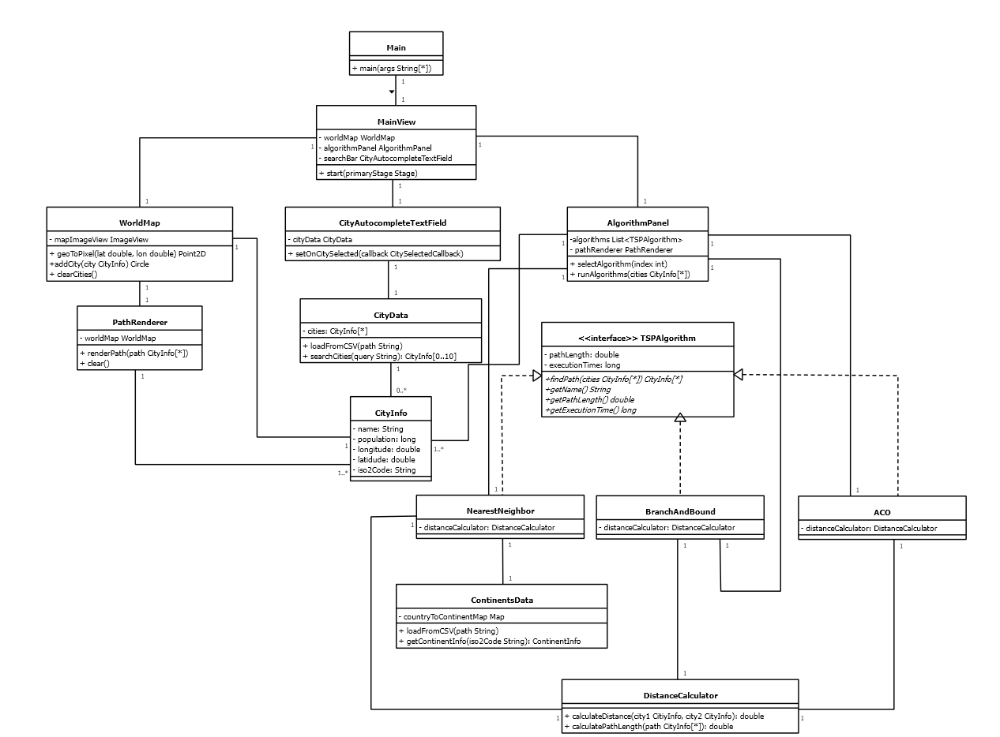
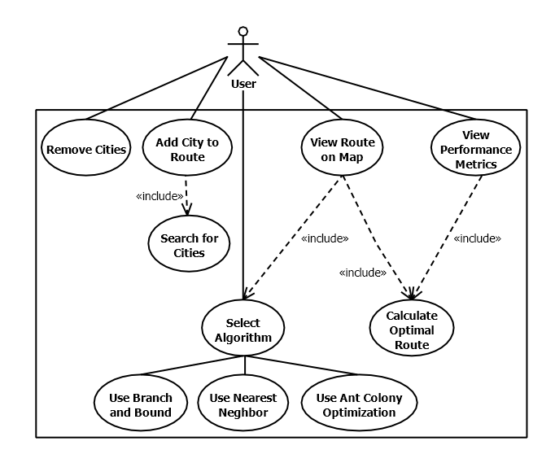

## Inhaltsverzeichnis

1. [Einleitung](#einleitung)
2. [Analyse des allgemeinen Problems](#analyse)
3. [Glossar](#glossar)
4. [Lösungsansätze](#loesungsansaetze)
5. [Softwarearchitektur](#architektur)
6. [Vergleich der Algorithmen](#vergleich)
7. [Reflexion](#reflexion)
8. [Quellenverzeichnis](#quellen)

## 1. Einleitung <a name="einleitung"></a>

Das **Traveling Salesperson Problem** (TSP) stellt eines der bekanntesten und meistuntersuchten Probleme der kombinatorischen Optimierung dar. Die Aufgabe, eine kürzeste Rundreise durch eine Menge von Städten zu finden, erscheint zunächst einfach, entpuppt sich jedoch als hochkomplexes mathematisches Problem. Seine Bedeutung für die theoretische Informatik liegt in seiner NP-Vollständigkeit, während seine praktische Relevanz von der Logistikoptimierung bis zur Genomsequenzierung reicht.

Im Rahmen dieses Protokolls werden drei unterschiedliche Lösungsansätze in Java implementiert und verglichen:

* Ein eigen abgeänderte Herangehensweise, der **Nearest-Neighbor**-Algorithmus, der stets die günstigste Route bis zur nächsten noch nicht besuchten Stadt berechnet
* Das **Branch-and-Bound**-Verfahren als exakter Algorithmus, der die optimale Lösung garantiert
* Die **Ant Colony Optimization** (ACO) als naturinspirierte Heuristik für effiziente Näherungslösungen

Die Implementierung erfolgt in Java mit besonderem Fokus auf objektorientiertes Design und wird durch eine grafische Benutzeroberfläche ergänzt (GUI). Die praktische Anwendung der Algorithmen erfolgt im Kontext der Optimierung von Verteilungsrouten für die vorgegebenen Städte, wobei sowohl Lösungsqualität als auch Laufzeitverhalten verglichen werden.

## 2. Analyse des allgemeinen Problems <a name="analyse"></a>

### Mathematische Formulierung

Das TSP wird als Graph **G = (V,E)** dargestellt:

* Die zu besuchenden Knoten: $$V$$
* Kanten zwischen den Orten (Verbindungen): $$E$$
* Kosten für jede Kante von Ort zu Ort: $$c\_{ij}$$
* Kanten nutzung (1 = in benutzt; 0 = nicht in benutzung): $$x\_{ij}$$

#### Zielfunktion:

$$\\min \\sum\_{i=1}^n \\sum\_{j=1}^n c\_{ij}x\_{ij}$$

Mit den Bedingungen:

* Jeder Ort wird genau einmal besucht: $$\\sum\_{j=1}^n x\_{ij} = 1$$
* Von jedem Ort wird genau einmal abgereist: $$\\sum\_{i=1}^n x\_{ij} = 1$$

### Komplexitätsanalyse

Das TSP ist NP-vollständig. Bei **n** Orten gibt es $$(n-1)!/2$$ mögliche Routen.

Beispiele für die Anzahl der Routen:

| Anzahl Orte | Mögliche Routen |
|-------------|-----------------|
| 5           | 12              |
| 10          | 181.440         |
| 15          | 43.589.145.600  |

### Distanzberechnung

Die Berechnung der exakten Distanzen zwischen den Städten erfolgt mittels des Vincenty-Algorithmus, der besonders für geografische Koordinaten geeignet ist. Dieser Algorithmus berücksichtigt die ellipsoidische Form der Erde und liefert sehr präzise Ergebnisse für geodätische Berechnungen. Die Java-Implementierung ermöglicht eine Genauigkeit von bis zu 0,5mm über die gesamte Erdoberfläche.

### Anwendungsbereiche

1. Logistik
   * Paketauslieferung
   * Tourenplanung
   * Warentransport
2. Produktion
   * Maschinensteuerung
   * Leiterplattenherstellung
   * Lagerlogistik
3. Informatik
   * Netzwerkoptimierung
   * Serverplatzierung
   * Datenverteilung

## 3. Glossar <a name="glossar"></a>

| Begriff             | Definition                                                                                                               |
|---------------------|--------------------------------------------------------------------------------------------------------------------------|
| TSP                 | Traveling Salesperson Problem - Optimierungsproblem zur Findung der kürzesten Rundreise durch mehrere Orte               |
| ACO                 | Ant Colony Optimization - Algorithmus, der das Verhalten von Ameisen bei der Futtersuche nachahmt                        |
| Branch-and-Bound    | Exaktes Lösungsverfahren, das den Lösungsraum systematisch durchsucht und nicht-optimale Lösungen ausschließt            |
| GUI                 | Graphical User Interface - Grafische Benutzeroberfläche zur Bedienung des Programms                                      |
| JavaFX              | Java-Framework zur Entwicklung von grafischen Benutzeroberflächen                                                        |
| Heuristik           | Näherungsverfahren, das schnell gute, aber nicht unbedingt optimale Lösungen findet                                      |
| Nearest Neighbor    | Einfacher Algorithmus, der immer zum nächstgelegenen noch nicht besuchten Ort geht                                       |
| Optimale Lösung     | Die bestmögliche Lösung für ein Problem (beim TSP: kürzeste mögliche Route)                                              |
| NP-vollständig      | Bezeichnet Probleme, für die keine effizienten Algorithmen bekannt sind und die Rechenzeit mit der Größe extrem ansteigt |
| Laufzeitkomplexität | Beschreibt, wie stark die Rechenzeit mit der Problemgröße wächst                                                         |
| Pruning             | "Beschneiden" - Technik beim Branch-and-Bound, um nicht-optimale Lösungszweige auszuschließen                            |
| Pheromon            | Beim ACO: Virtueller "Duftstoff", der gute Routen markiert                                                               |
| Iterativ            | Schrittweise Vorgehensweise mit Wiederholungen                                                                           |
| Determinismus       | Eigenschaft eines Algorithmus, bei gleichen Eingaben immer gleiche Ausgaben zu liefern                                   |
| Parallelisierung    | Aufteilung der Berechnung auf mehrere Prozessoren zur Beschleunigung                                                     |
| Threading           | Parallele Ausführung von Programmteilen, wichtig für responsive GUIs                                                     |
| Parameter           | Einstellbare Werte, die das Verhalten eines Algorithmus beeinflussen                                                     |
| Bound               | Schranke - Abschätzung der minimal möglichen Weglänge beim Branch-and-Bound                                              |
| Optimierungsproblem | Mathematisches Problem, bei dem die beste Lösung unter bestimmten Bedingungen gesucht wird                               |
| Konvergenz          | Beschreibt, wie schnell sich ein Algorithmus der optimalen Lösung annähert                                               |
| Fuzzy-search        | Eine Suchmethode, die auch bei ungenauen Eingaben oder Tippfehlern passende Ergebnisse findet                            |

## 4. Lösungsansätze <a name="loesungsansaetze"></a>

Die Lösungsansätze für das TSP lassen sich in drei Hauptkategorien einteilen:

1. Exakte Verfahren (wie Branch and Bound)
2. Heuristische Verfahren (wie Ant Colony Optimization)
3. Modifizierte klassische Verfahren (wie unser angepasster Nearest Neighbor)

### Branch and Bound-Verfahren

Branch and Bound ist ein exaktes Verfahren, das die optimale Lösung garantiert findet. Es arbeitet nach dem Prinzip der systematischen Suche und des Ausschlusses suboptimaler Lösungen.

#### Funktionsweise:

1. **Branching (Verzweigung)**
   * Aufteilung in Teilprobleme
   * Aufbau eines Suchbaums
   * Systematische Exploration möglicher Routen
2. **Bounding (Schrankenberechnung)**
   * Berechnung unterer Schranken für Teilprobleme
   * Abschätzung der minimalen Tourlänge
   * Nutzung von Minimalen Spannbäumen
3. **Pruning (Beschneiden)**
   * Ausschluss von Teilproblemen
   * Reduzierung des Suchraums
   * Fokussierung auf vielversprechende Bereiche

#### Algorithmus:

```pseudo
function branchAndBound(cities):
    bestTour = null
    bestCost = infinity
    queue = new PriorityQueue()
    queue.add(new Node(startCity))

    while !queue.isEmpty():
        node = queue.removeMin()
        if node.bound < bestCost:
            if isCompleteTour(node):
                updateBestTour(node)
            else:
                for city in unvisitedCities(node):
                    newNode = createNode(node, city)
                    queue.add(newNode)

    return bestTour
```

### Ant Colony Optimization (ACO)

ACO ist ein naturinspirierter Algorithmus, der das Verhalten von Ameisenkolonien bei der Futtersuche nachahmt und für große Probleminstanzen gut geeignet ist.

#### Funktionsweise:

1. **Pheromonmodell**
   * Ablage von Pheromonen auf Wegen
   * Verdunstung über Zeit
   * Stärkung guter Pfade
2. **Tourenkonstruktion**
   * Probabilistische Stadtauswahl
   * Berücksichtigung von Distanzen
   * Nutzung von Pheromonspuren
3. **Aktualisierung**
   * Verdunstung alter Pheromone
   * Verstärkung guter Routen
   * Adaptive Anpassung

#### Algorithmus:

```pseudo
function antColonyOptimization(cities):
    initializePheromones()
    bestTour = null

    while !terminationCondition():
        antTours = []
        for ant in ants:
            tour = constructTour(cities)
            updatePheromones(tour)
            antTours.add(tour)

        evaporatePheromones()
        updateBestTour(antTours)

    return bestTour
```

### Modifizierter Nearest Neighbor mit Kostenzonenmodell

Der modifizierte Nearest Neighbor Algorithmus erweitert den klassischen Ansatz um ein Kostenzonenmodell, das reale geografische oder organisatorische Grenzen berücksichtigt.

#### Funktionsweise:

1. **Zonenmodell**
   * Einteilung in Kostenzonen
   * Unterschiedliche Übergangskosten
   * Präferenz für Intrazonen-Bewegungen
2. **Kostenberechnung**
   * Distanzbasierte Grundkosten (unter Verwendung des Vincenty-Algorithmus)
   * Zonenfaktor-Multiplikator
   * Berücksichtigung von Grenzen
3. **Tourenkonstruktion**
   * Greedy-Auswahl nächster Städte
   * Zonenbasierte Kostenbewertung
   * Effiziente Routenfindung

#### Algorithmus:

```pseudo
function modifiedNearestNeighbor(cities, zones):
    currentCity = startCity
    tour = [currentCity]

    while unvisitedCities exist:
        nextCity = findCheapestNextCity(currentCity, zones)
        tour.add(nextCity)
        currentCity = nextCity

    tour.add(startCity)
    return tour

function findCheapestNextCity(current, zones):
    minCost = infinity
    bestCity = null

    for city in unvisitedCities:
        cost = vincentyDistance(current, city) * zoneFactor(current, city)
        if cost < minCost:
            minCost = cost
            bestCity = city

    return bestCity
```

## 5. Softwarearchitektur <a name="architektur"></a>

### Klassendiagramm:

Beschreibung:
Das Klassendiagramm zeigt die technische Struktur der Anwendung nach dem Model-View-Controller-Prinzip. Die MainView-Klasse fungiert als zentraler Koordinator und verbindet die verschiedenen Komponenten. Das GUI-System besteht aus einer WorldMap zur Kartendarstellung mit integriertem PathRenderer für die Routenvisualisierung sowie einem CityAutocompleteTextField für die Städtesuche. Das Datenmodell wird durch die CityData-Klasse repräsentiert, die einzelne CityInfo-Objekte verwaltet und durch ContinentsData ergänzt wird. Die algorithmische Komponente basiert auf dem TSPAlgorithm-Interface, das von den drei konkreten Implementierungen (NearestNeighbor, BranchAndBound, ACO) implementiert wird. Ein gemeinsam genutzter DistanceCalculator ermöglicht die einheitliche Berechnung von Entfernungen. Die Klassenstruktur ist modular aufgebaut und ermöglicht eine klare Trennung der Verantwortlichkeiten sowie einfache Erweiterbarkeit.

### Anwendungsdiagramm:

Beschreibung:
Das Anwendungsdiagramm illustriert die Kernfunktionalitäten der TSP-Anwendung aus der Benutzerperspektive. Der Benutzer steht im Zentrum und interagiert mit verschiedenen Hauptfunktionen: Er kann Städte zur Route hinzufügen oder entfernen, die berechnete Route auf einer Karte visualisieren und Performance-Metriken einsehen. Die Städteauswahl wird durch eine Suchfunktion unterstützt. Ein zentrales Element ist die Algorithmusauswahl, bei der der Benutzer zwischen drei verschiedenen Verfahren wählen kann: Branch and Bound für exakte Lösungen, Nearest Neighbor für schnelle Näherungen und Ant Colony Optimization als naturinspirierte Heuristik. Die "include"-Beziehungen zeigen die logischen Abhängigkeiten zwischen den Funktionen, wobei die Routenberechnung und -visualisierung eng mit der Algorithmusauswahl verknüpft sind.
## 6. Vergleich der Algorithmen <a name="vergleich"></a>

### Theoretischer Vergleich

Die drei implementierten Algorithmen unterscheiden sich grundlegend in ihren theoretischen Eigenschaften:

| Kriterium                   | Branch & Bound       | ACO               | Mod. Nearest Neighbor |
|-----------------------------|----------------------|-------------------|-----------------------|
| Optimalität                 | ✓ Garantiert optimal | × Näherungslösung | × Näherungslösung     |
| Zeitkomplexität             | O(n!)                | O(n²m)            | O(n²)                 |
| Speicherbedarf              | Hoch                 | Mittel            | Niedrig               |
| Implementierungskomplexität | Komplex              | Mittel            | Einfach               |
| Skalierbarkeit              | Schlecht             | Gut               | Sehr gut              |
| Parallelisierbarkeit        | Begrenzt             | Sehr gut          | Begrenzt              |
| Adaptivität                 | Keine                | Hoch              | Keine                 |
| Deterministisch             | Ja                   | Nein              | Ja                    |

### Praktischer Vergleich

#### Testumgebung

* Hardware: i7-12700K 32GB RAM
* Betriebssystem: Windows 11 24h2
* OpenJDK Version: 17.0.13 2024-10-15

#### Testszenarien

##### 1. Kleine Instanzen (10 Städte)

| Algorithmus           | Durchschn. Laufzeit | Beste Route |
|-----------------------|---------------------|-------------|
| Branch & Bound        | 787.300 ns          | 1642,98 km  |
| ACO                   | 11,903 ms           | 1642,98 km  |
| Mod. Nearest Neighbor | 54.500 ns           | 1855,35 km  |

##### 2. Mittlere Instanzen (16 Städte)

| Algorithmus           | Durchschn. Laufzeit | Beste Route |
|-----------------------|---------------------|-------------|
| Branch & Bound        | 57,213 ms           | 1903 km     |
| ACO                   | 21,276 ms           | 1888,25 km  |
| Mod. Nearest Neighbor | 73.400 ns           | 1951 km     |

### Empfehlungen für den praktischen Einsatz

* Für kleine Probleme (≤10 Städte): Branch & Bound wegen Optimalitätsgarantie
* Für mittlere Probleme (11-20 Städte): ACO wegen bestem Verhältnis Zeit/Qualität
* Für zeitkritische Anwendungen: Modifizierter Nearest Neighbor
* Für parallelisierbare Umgebungen: ACO wegen guter Skalierung

## 7. Reflexion <a name="reflexion"></a>

### Technische Erkenntnisse

* Die praktische Implementierung von Branch and Bound zeigte deutlich die Grenzen exakter Verfahren bei wachsender Problemgröße
* JavaFX erwies sich als leistungsfähiges Framework für die Visualisierung der Algorithmen
* Die Parameterwahl bei ACO hat signifikanten Einfluss auf Laufzeit und Lösungsqualität
* Die Integration des Vincenty-Algorithmus für präzise Distanzberechnungen erwies sich als wichtiger Faktor für die Genauigkeit der Ergebnisse

### Herausforderungen

* Effiziente Implementierung der Datenstrukturen für Branch and Bound, besonders bei der Verwaltung des Suchbaums
* Performance-Optimierung bei großen Datensätzen ohne Beeinträchtigung der GUI-Reaktivität
* Balance zwischen Laufzeitoptimierung und Codequalität/Wartbarkeit
* Korrekte Implementierung der geodätischen Berechnungen mit dem Vincenty-Algorithmus

### Verbesserungspotenzial

* Integration zusätzlicher Heuristiken wie 2-Opt oder 3-Opt zur lokalen Optimierung
* Implementierung einer verteilten Berechnung für Branch and Bound
* Erweiterte Visualisierungsmöglichkeiten für den Lösungsprozess
* Optimierung der Vincenty-Distanzberechnung durch Caching häufig verwendeter Strecken

### Projektmanagement-Erkenntnisse

* Agile Entwicklungsmethoden bewährten sich bei der schrittweisen Implementierung
* Kontinuierliche Integration half bei der frühen Erkennung von Problemen
* Code-Reviews verbesserten die Qualität und das gemeinsame Verständnis

### Persönliche Entwicklung

* Vertiefte Kenntnisse in der Implementierung komplexer Algorithmen
* Verbessertes Verständnis für die Bedeutung von Codequalität und Dokumentation
* Erfahrung in der Optimierung rechenintensiver Prozesse
* Praktische Erfahrung mit geodätischen Berechnungen durch die Arbeit mit dem Vincenty-Algorithmus

### Ausblick

* Mögliche Erweiterung um weitere Algorithmen wie genetische Algorithmen
* Integration realer Verkehrsdaten für praktischere Anwendungen
* Entwicklung einer Web-basierten Version der Anwendung
* Optimierung für sehr große Datensätze (>1000 Städte)
* Integration von Höhendaten für noch präzisere Distanzberechnungen

## 8. Quellenverzeichnis <a name="quellen"></a>

### Grundlagen des TSP

1. Applegate, D., Bixby, R., Chvátal, V., & Cook, W. (2006). The Traveling Salesman Problem: A Computational Study. Princeton University Press.
   * Umfassende mathematische Grundlagen des TSP
   * Standardwerk für die exakte Problemformulierung
   * https://en.wikipedia.org/wiki/Travelling_salesman_problem (Zugriff am 12.12.2024)
2. Cook, W. (2012). In Pursuit of the Traveling Salesman: Mathematics at the Limits of Computation. Princeton University Press.
   * Historischer Kontext und Entwicklung des Problems
   * Aktuelle Forschungsansätze und Anwendungen
   * https://en.wikipedia.org/wiki/TSP (Zugriff am 16.12.2024)

### Algorithmen und Implementierungen

1. Dorigo, M., & Stützle, T. (2019). Ant Colony Optimization: Overview and Recent Advances. In Handbook of Metaheuristics (pp. 311-351). Springer.
   * Detaillierte Beschreibung der ACO-Methodik
   * Aktuelle Entwicklungen und Varianten
   * DOI: 10.1007/978-3-319-91086-4_10
2. Land, A. H., & Doig, A. G. (2010). An Automatic Method of Solving Discrete Programming Problems. In 50 Years of Integer Programming 1958-2008 (pp. 105-132). Springer.
   * Originalpublikation zum Branch-and-Bound-Verfahren
   * Theoretische Grundlagen und Beweise

### Geodätische Algorithmen

1. Vincenty, T. (1975). Direct and Inverse Solutions of Geodesics on the Ellipsoid with Application of Nested Equations. Survey Review, 23(176), 88-93.
   * Grundlegende Beschreibung des Vincenty-Algorithmus
   * Mathematische Herleitung und Implementierungsdetails
   * DOI: 10.1179/sre.1975.23.176.88

### Online-Dokumentationen und Tutorials

1. Princeton University (2024). "Programming Assignment: TSP". CS Department.
   * Praktische Implementierungsbeispiele und Übungsaufgaben
   * https://www.cs.princeton.edu/courses/archive/spr15/cos126/assignments/tsp.html (Zugriff am 16.12.2024)

### Technische Spezifikationen

1. Oracle (2024). "Java SE Technical Documentation".
   * Referenz für die Java-Implementierung
   * https://docs.oracle.com/en/java/
   * Zugriff am 16.12.2024

### Ergänzende Ressourcen

1. European Union (2024). "TSPLIB - Library of Sample Instances for the TSP".
   * Standardisierte Testinstanzen und Benchmarks
   * http://comopt.ifi.uni-heidelberg.de/software/TSPLIB95/
   * Zugriff am 16.12.2024