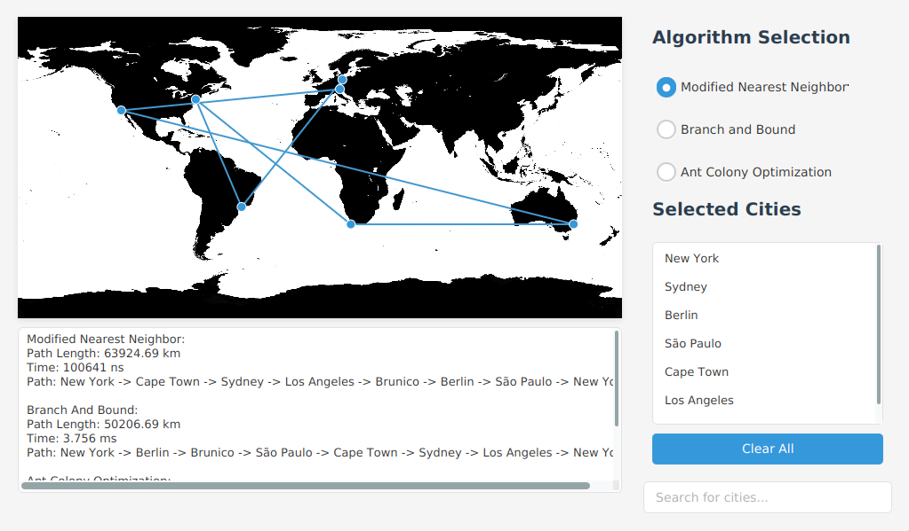

# TSP Demo

A Java application implementing and comparing three different algorithms for solving the Traveling Salesperson Problem (TSP) with an interactive JavaFX GUI.

## Overview

The Traveling Salesperson Problem is one of the most studied optimization problems in computer science. This project implements three distinct approaches to solving the TSP and provides a visual comparison of their performance and solution quality.



## Implemented Algorithms

### 1. Branch and Bound (Exact Algorithm)

- **Guarantees optimal solution** through systematic search
- Divides the problem into smaller subproblems (branching)
- Calculates bounds for subproblems to prune unpromising branches
- **Time Complexity**: O(n!)
- **Best for**: Small instances (≤10 cities) where optimal solution is required
- **Note**: Limited to 17 cities to prevent excessive computation time (>20 seconds)

### 2. Ant Colony Optimization (ACO) - Heuristic Algorithm

- **Nature-inspired algorithm** mimicking ant foraging behavior
- Uses pheromone trails to guide solution construction
- Iteratively improves solutions through multiple ant iterations
- **Time Complexity**: O(n²m) where m is number of iterations
- **Best for**: Medium to large instances (11-20+ cities) with good time/quality ratio
- **Features**: Parallelizable, adaptive, probabilistic

### 3. Modified Nearest Neighbor - Regional Cost Model

- **Custom adaptation** of the classic nearest neighbor approach
- Uses regional cost zones instead of pure distance:
  - Same country < Same subcontinent < Same continent < Different continent
- **Time Complexity**: O(n²)
- **Best for**: Time-critical applications requiring fast approximations
- **Features**: Fast execution, deterministic, simple implementation

## Features

- **Interactive GUI** with world map visualization
- **Real-time algorithm comparison** showing path length and execution time
- **Precise distance calculations** using the Vincenty algorithm (accuracy up to 0.5mm)
- **City selection** from a predefined global dataset
- **Route visualization** with connected paths on world map
- **Performance metrics** for all three algorithms

## Prerequisites

- Java 17 or higher
- Gradle build system

## Dependencies

- JavaFX 17.0.2 (controls, fxml, graphics, base)
- OpenCSV 5.7.1 (for data parsing)
- FuzzyWuzzy 1.4.0 (for fuzzy search functionality)

## Building and Running

### Using Gradle

```bash
# Clone the repository
git clone <repository-url>
cd TSP_Demo

# Build the project
./gradlew build

# Run the application
./gradlew run

# Create a fat JAR (includes all dependencies)
./gradlew fatJar
```

### Running the Fat JAR

```bash
java -jar build/libs/TSP_Demo-1.0-fat.jar
```

## Usage

1. **Launch the application** to see the world map interface
2. **Select cities** by searching and clicking from the city list
3. **Choose an algorithm** using the radio buttons:
   - Modified Nearest Neighbor (fastest)
   - Branch and Bound (optimal for small sets)
   - Ant Colony Optimization (best balance)
4. **View results** including:
   - Calculated route on the map
   - Total path length in kilometers
   - Execution time
   - Optimal path sequence

## Performance Benchmarks

Tested on i7-12700K, 32GB RAM, Windows 11:

| Cities    | Branch & Bound       | ACO                 | Modified Nearest Neighbor |
| --------- | -------------------- | ------------------- | ------------------------- |
| 8 cities  | 787.3 μs, 1642.98 km | 11.9 ms, 1642.98 km | 54.5 μs, 1855.35 km       |
| 15 cities | 57.2 ms, 1903 km     | 21.3 ms, 1888.25 km | 73.4 μs, 1951 km          |

## Algorithm Selection Guidelines

- **Small problems (≤10 cities)**: Use Branch & Bound for guaranteed optimal solution
- **Medium problems (11-20 cities)**: Use ACO for best time/quality ratio
- **Time-critical applications**: Use Modified Nearest Neighbor for fastest results
- **Parallelizable environments**: Use ACO for best scalability

## Technical Details

- **Distance Calculation**: Vincenty algorithm for high-precision geodesic distances
- **GUI Framework**: JavaFX with FXML for interface design
- **Threading**: Background processing to maintain UI responsiveness
- **Data Structure**: Graph representation with adjacency matrix
- **Optimization**: Efficient pruning strategies for Branch and Bound

## Limitations

- Branch and Bound is limited to 17 cities for practical execution time
- Modified Nearest Neighbor doesn't guarantee optimal solutions
- ACO results may vary between runs due to probabilistic nature
- GUI requires display system (not suitable for headless servers)
